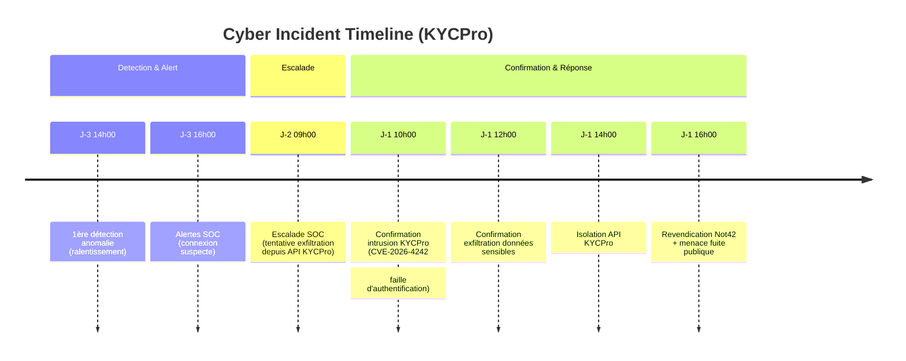

# Présentation COMEX — Incident de sécurité J+0 09h00

> Retrouver la timeline de la gestion de la cybercrise et le compte-rendu de la réunion COMEX avec matrice d'arbitrage: [Timeline Gestion Cybercrise](./timeline-crise.md).  
> Simulation · Format présentateur assumé (RSSI) · Format Présentation Slide + Notes personnelles du présentateur

> Note pédagogique : Les slides sont conçues pour une présentation en séance - support minimal, orateur indispensable. Les notes personnelles du présentateur reconstituent le discours du RSSI et ses arbitrages en temps réel.

---

## SLIDE 1 — [Incident confirmé: Exfiltration en cours]

1- Confirmation exfiltration 5000 données clients sensibles ((IBAN, emails, SSN – 5 000 clients)
2- Cause: Exploit authentification KYCPro
3- Mitigation: Isolation API KYCPro du reste Open Banking

> **Note**
> Forensique en cours pour déterminer ampleur totale fuite  
> KYC essentiel dans vérification identité clients - indispensable dans continuité business BanqueConnect  
> KYCPro seul fournisseur à date  

---

## SLIDE 2 — [Timeline CYBERCRISE]

> **Note**
> 2H entre 1eres anomalies et 1eres alertes SOC  
> 44H jusqu'à confirmation exploit par KYCPro et 46H confirmation exfiltration données sensibles  
> Incident RGPD confirmé: délai court depuis 19H  
> Incident DORA à anticper: délai 4H à partir qualification incident majeur --> imminent  
> Crise médiatique en cours : ce matin 08h00 article dans les Echos  

---

## SLIDE 3 — [Rappel obligations réglementaires]

1- DORA: Notifier l’ACPR sous 4h (dès qualification formelle : imminente) + Rapport intermédiaire sous 72H
2- CNIL:  Notifier la CNIL + clients concernés sous 72H

Décision requise: qualification officielle incident majeur.

> **Note**
> DORA: anticipation de la qualification crise majeure probable; principe de précaution, en assumant que la qualification formelle interviendra dans l'heure  
> DORA: forensic suffisant pour qualifier avec certitude --> nombre de clients impactés, nature des données, impact opérationnel, contagion potentielle  
> DORA: risques sanctions  
> CNIL: délai maintenant sous 51H  
>  CNIL: Risque de sanctions (4% CA)  
> CNIL - Personnes concernés --> Risque élevé (IBAN + SSN exposés → risque de fraude/usurpation)  

---

## SLIDE 4 — [Arbitrage du jour]

- Décision requise : approbation coupure API - effet immédiat
- Impact business: ~2M€/jour
- Risque élevé nouvelles fuites

> **Note**
> Risque inacceptable de nouvelle fuite. Je recommande la coupure  
> Solution intermédiaire (non recommandé au vu risque sécurité): Maintenir l’API avec surveillance renforcée (logs en temps réel) + Rate-limiting sur les endpoints sensibles  

---

## SLIDE 5 — [Prochaines étapes sous 48H]
- Rapport global forensique sur volume clients impactés
- Trouver solution KYC: correction Faille KYCPro ou solution de remplacement (ex. Onfido)
- Lancer procédures gestion des incidents CNIL et DORA
- Documenter les manquements contractuels KYCPro
- Lancer communication de crise / cellule juridique sur revendication Not42 / Articles de presse

> **Note**
> A moyen terme: Rapport final DORA sous 30 jours  
> Retour d'expérience à planifier sous 30 jours également  
> Renforcer clauses DORA fournisseurs  